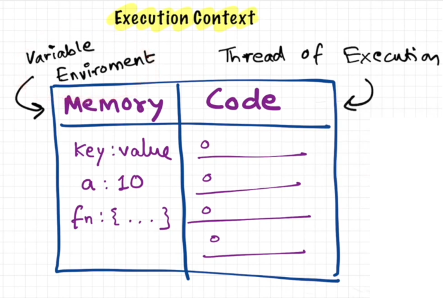
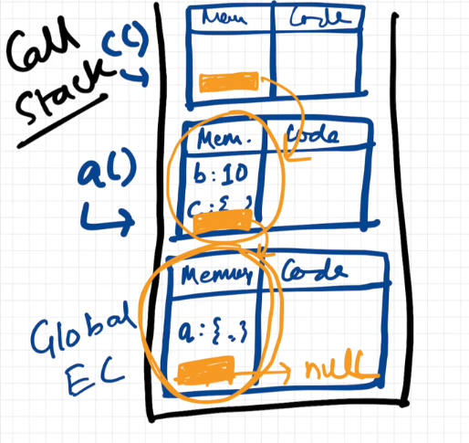

# JavaScript Knowledge
> Everything in JavaScript happens in Execution Context



> JavaScript is a synchronous Single-Threaded Language

> Execution happens in 2 phases 
> 
> phase 1 , Memory exectuion phase, variables get undefined and Function is fully saved
> 
> Phase 2, Code exectuion phase , values of variables are given to variable , and if fuction is called, new exectuion context is created and phase 1 and phase 2 again happen for this method.
>
> It manages all this in a call Stack , where Global exectuion context is @ the bottom.

Call Stack is also know as --
1. Execution Context Stack
2. Program Stack
3. Control Stack
4. Runtime Stack 
5. Machine Stack

> JavaScipt is a loosly typed language,
```JavaScript
var a;
console.log(a);
a = 10;
console.log(a);
a = "hello world";
console.log(a);
```
> never Do **var a = undefined;**

> Scope is directly dependent on Lexical Environment
> Every function has lexical environment of it's parent

**Scope Chain**
> if variable is not fond in local memory, it will go to lexical environment of Parent, and this is called as Scope Chain


```javascript
function a() {
    console.log("in function a::" + num);
    b();
    function b() {
        console.log("in function b::" + num);
        c();
        function c() {
            console.log("in function c::" + mum);
        }
    }
}
var num = 10;
a();
console.log("in globla function ::" + num);

/**
 * Every function has lexical environment of it's parent
 * function C has lexical environment of function A
 * function A has lexical environment of function Global
 * Global has lexical environment as null
 */
```

Thanks To **@Akshay Saini** for sharing the knowledge